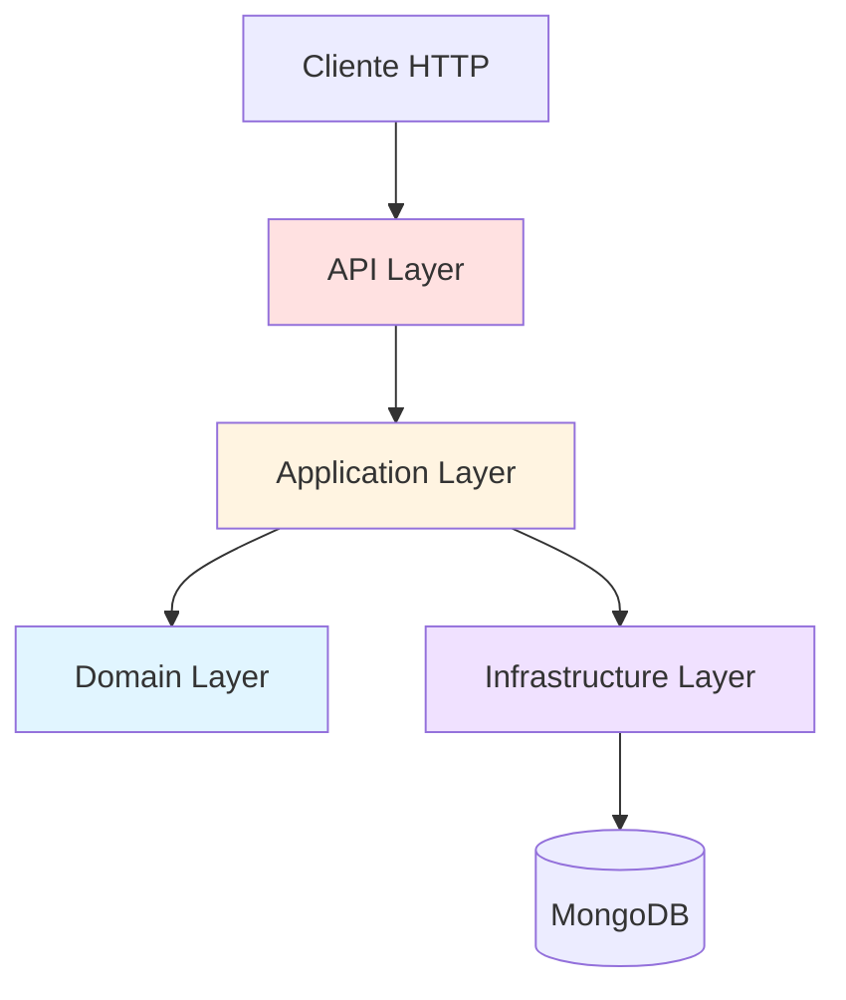

# Ejemplo: API REST de Gestión de Transporte

> **Contexto para Claude AI:** API REST con arquitectura DDD | TypeScript + Express + MongoDB | Estado: CRUD Drivers completo | Tests: 16/16 pasando | Coverage: 83.58%

API REST construida con TypeScript, Express y MongoDB siguiendo la arquitectura Domain-Driven Design (DDD) para gestionar datos de transporte, específicamente conductores de vehículos.


## 🚀 Inicio Rápido

```bash
# Instalar dependencias
npm install

# Iniciar en desarrollo
npm run dev

# Ejecutar tests
npm test
```

👉 **[Guía Completa de Inicio Rápido](QUICK-START.md)**

## 📚 Documentación

### Para Empezar
- 📖 **[Guía Rápida](QUICK-START.md)** - Puesta en marcha en 5 minutos
- 🎯 **[Referencia de API](docs/API-REFERENCE.md)** - Todos los endpoints con ejemplos

### Para Desarrolladores
- 🏗️ **[Arquitectura DDD](docs/ARCHITECTURE.md)** - Diagramas y estructura detallada
- 🤖 **[Trabajar con Claude AI](docs/WORKING-WITH-CLAUDE.md)** - Guía específica para Claude Code AI
- 🧪 **[Testing](docs/TESTING.md)** - Estrategia y guía de tests
- 💻 **[Guía de Desarrollo](docs/DEVELOPMENT.md)** - Convenciones y workflow
- 📐 **[Patrones de Código](docs/PATTERNS.md)** - Ejemplos completos

### Referencia Técnica
- 🚨 **[Excepciones de Dominio](src/domain/exceptions/README.md)** - Catálogo completo
- 🔧 **[Excepciones de Infraestructura](src/infrastructure/exceptions/README.md)**
- 📊 **[Migración](MIGRATION.md)** - Guía de migración
- 📝 **[Resumen Técnico](RESUMEN.md)** - Overview del proyecto

## 🎯 Características

- ✅ Arquitectura DDD (Domain-Driven Design)
- ✅ Clean Architecture de 3 capas
- ✅ TypeScript para type safety
- ✅ MongoDB como base de datos
- ✅ CRUD completo para conductores
- ✅ Sistema de excepciones específicas
- ✅ Tests de integración exhaustivos (16 tests)
- ✅ Validación de datos en capa de dominio
- ✅ DTOs organizados por módulo
- ✅ UUID v7 para IDs optimizados con MongoDB

## 🛠️ Stack Tecnológico

| Tecnología | Versión | Propósito |
|------------|---------|-----------|
| **Node.js** | v18+ | Runtime |
| **TypeScript** | 5.x | Lenguaje |
| **Express** | 4.x | Framework web |
| **MongoDB** | 6.x | Base de datos |
| **Jest** | Latest | Testing |
| **mongodb-memory-server** | Latest | Tests in-memory |

## 📁 Estructura del Proyecto

```
nodejs-ddd-api/
├── src/
│   ├── domain/              # 🎯 Capa de Dominio (lógica de negocio)
│   │   ├── entities/        # Entidades (Driver)
│   │   ├── repositories/    # Interfaces de repositorios
│   │   └── exceptions/      # Excepciones de dominio
│   │
│   ├── application/         # 🔄 Capa de Aplicación (casos de uso)
│   │   ├── use-cases/       # Casos de uso por módulo
│   │   └── dtos/            # Data Transfer Objects
│   │
│   └── infrastructure/      # 🔧 Capa de Infraestructura
│       ├── api/             # Express (controllers, routes)
│       ├── persistence/     # MongoDB (repositories)
│       └── exceptions/      # Excepciones de infraestructura
│
├── test/                    # 🧪 Tests
│   ├── integration/         # Tests de API (16 tests)
│   └── helpers/             # Utilities para tests
│
├── docs/                    # 📚 Documentación detallada
│   ├── ARCHITECTURE.md
│   ├── WORKING-WITH-CLAUDE.md
│   ├── TESTING.md
│   ├── DEVELOPMENT.md
│   ├── PATTERNS.md
│   └── API-REFERENCE.md
│
├── QUICK-START.md           # Inicio rápido
└── README.md                # Este archivo
```

**Detalle completo**: Ver [Arquitectura DDD](docs/ARCHITECTURE.md)

## 📡 API Endpoints

| Método | Endpoint | Descripción | Status |
|--------|----------|-------------|--------|
| `GET` | `/health` | Health check | ✅ |
| `POST` | `/api/conductores` | Crear conductor | ✅ |
| `GET` | `/api/conductores` | Listar conductores | ✅ |
| `GET` | `/api/conductores/:id` | Obtener por ID | ✅ |
| `PUT` | `/api/conductores/:id` | Actualizar conductor | ✅ |
| `DELETE` | `/api/conductores/:id` | Eliminar conductor | ✅ |

**Ejemplos completos**: Ver [API Reference](docs/API-REFERENCE.md)

## 🧪 Testing

```bash
# Ejecutar todos los tests
npm test

# Tests en modo watch
npm run test:watch

# Solo tests de integración
npm run test:integration
```

**Resultados actuales:**
- ✅ 16 tests pasando
- ✅ 83.58% coverage
- ✅ ~2.5s tiempo de ejecución

**Guía completa**: Ver [Testing](docs/TESTING.md)

## 🏗️ Arquitectura

El proyecto sigue **Domain-Driven Design** con **Clean Architecture**:



**Flujo de una request:**
```
HTTP Request → Controller → Use Case → Entity → Repository → MongoDB
```

**Documentación completa**: Ver [Arquitectura DDD](docs/ARCHITECTURE.md)

## 🤖 Trabajar con Claude AI

Este proyecto está optimizado para colaboración con Claude Code AI.

**Prompts útiles:**
```
"Crea una nueva entidad Vehicle siguiendo el patrón de Driver"
"Agrega validación de edad mínima (18 años) en Driver"
"Implementa endpoint GET /api/conductores/search?licencia=ABC123"
```

**Guía completa**: Ver [Trabajar con Claude AI](docs/WORKING-WITH-CLAUDE.md)

## 📝 Estado de Implementación

### ✅ Implementado
- [x] Entidad `Driver` con validaciones completas
- [x] CRUD completo de conductores
- [x] Sistema de excepciones específicas organizadas
- [x] DTOs organizados por módulo
- [x] Tests de integración (16 tests)
- [x] Arquitectura DDD de 3 capas

### 🚧 Por Implementar
- [ ] Entidad `Vehicle`
- [ ] Entidad `Route`
- [ ] Tests unitarios
- [ ] Middleware de validación
- [ ] Paginación
- [ ] Autenticación y autorización
- [ ] Logging y monitoreo

## 🔒 Validaciones

- ✅ Todos los campos requeridos
- ✅ Email con formato válido
- ✅ Licencia única en el sistema
- ✅ Fechas válidas
- ✅ Nombres y apellidos no vacíos

## 🐛 Manejo de Errores

Sistema de excepciones específicas:

```typescript
// Dominio
throw new DriverNotFoundException(id);
throw new DuplicateLicenseException(licencia);
throw new ValidationException('Email inválido', 'email');

// Infraestructura
throw new DatabaseNotConnectedException();
```

**Códigos HTTP:**
- `200` OK - Operación exitosa
- `201` Created - Recurso creado
- `204` No Content - Eliminación exitosa
- `400` Bad Request - Datos inválidos
- `404` Not Found - Recurso no encontrado
- `500` Internal Server Error - Error del servidor

## 📊 Modelo de Datos

### Conductor (Driver)

```typescript
{
  id: string;              // UUID v7 (optimizado para MongoDB)
  nombre: string;          // Requerido
  apellido: string;        // Requerido
  licencia: string;        // Requerido, único
  telefono: string;        // Requerido
  email: string;           // Requerido, formato válido
  fechaNacimiento: Date;   // Requerido
  activo: boolean;         // Default: true
  fechaCreacion: Date;     // Auto
  fechaActualizacion: Date;// Auto
}
```

**Nota sobre IDs:** El proyecto usa UUID v7 (RFC 9562) para generar identificadores. UUID v7 es cronológicamente ordenado, lo que optimiza el rendimiento de índices en MongoDB reduciendo fragmentación y mejorando la velocidad de inserciones hasta 10x comparado con UUIDs aleatorios.

## 🤝 Contribuir

1. Fork el proyecto
2. Crea una rama para tu feature (`git checkout -b feature/AmazingFeature`)
3. Commit tus cambios (`git commit -m 'Add some AmazingFeature'`)
4. Push a la rama (`git push origin feature/AmazingFeature`)
5. Abre un Pull Request

**Guías**:
- [Guía de Desarrollo](docs/DEVELOPMENT.md)
- [Patrones de Código](docs/PATTERNS.md)

## 📖 Aprende Más

### Domain-Driven Design
- [DDD por Martin Fowler](https://martinfowler.com/bliki/DomainDrivenDesign.html)
- [Clean Architecture](https://blog.cleancoder.com/uncle-bob/2012/08/13/the-clean-architecture.html)

### TypeScript y Node.js
- [TypeScript Handbook](https://www.typescriptlang.org/docs/)
- [Node.js Best Practices](https://github.com/goldbergyoni/nodebestpractices)

## 📄 Licencia

ISC

## 👤 Autor

Proyecto de ejemplo para demostración de arquitectura DDD con TypeScript y MongoDB.

---

**¿Listo para empezar?** → [Guía Rápida](QUICK-START.md)

**¿Trabajas con Claude AI?** → [Guía para Claude](docs/WORKING-WITH-CLAUDE.md)
