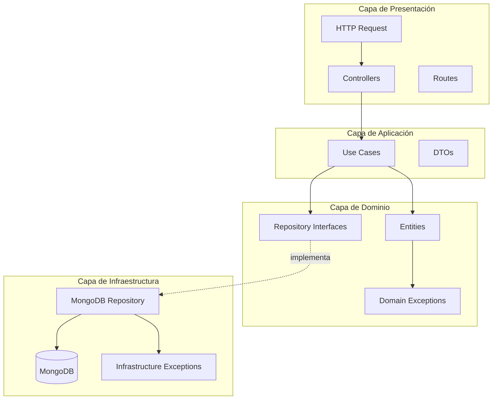
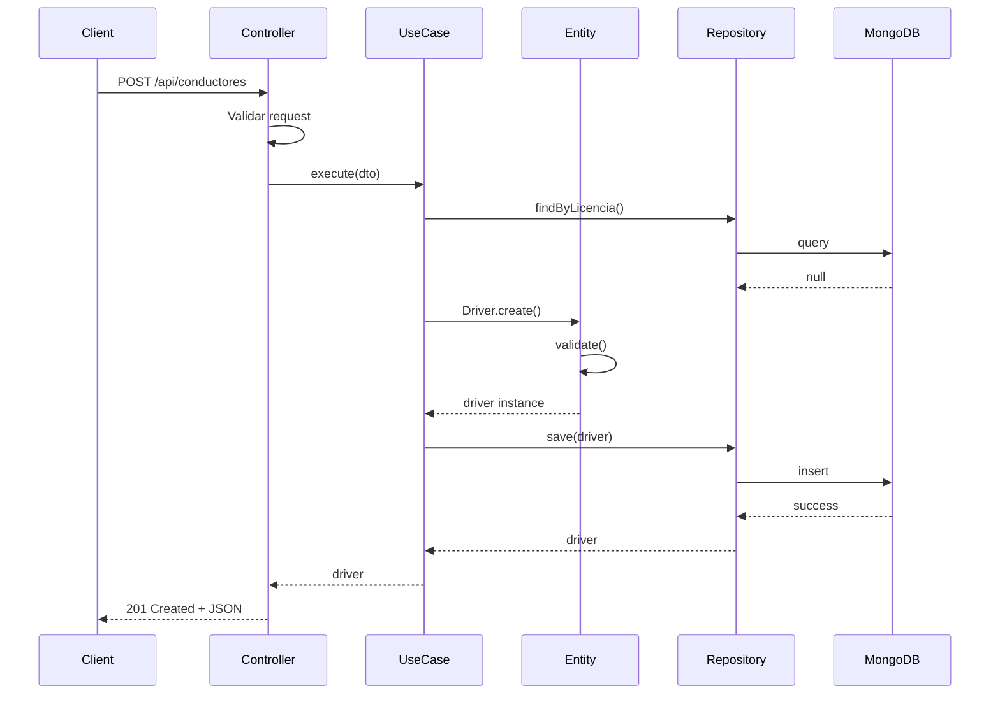
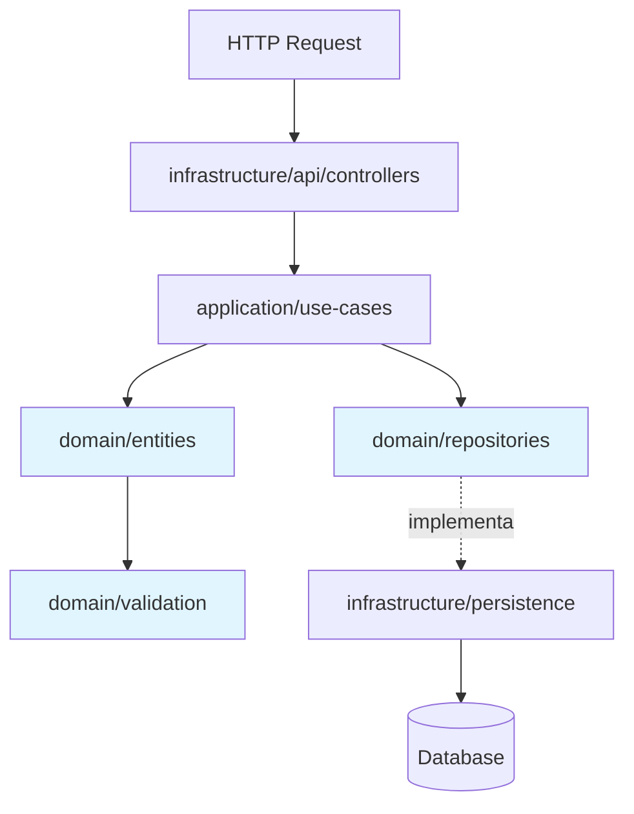

# Arquitectura DDD

Este documento describe en detalle la arquitectura Domain-Driven Design (DDD) implementada en el proyecto.

## Visión General

El proyecto sigue los principios de Domain-Driven Design con una arquitectura limpia de tres capas que garantiza la separación de responsabilidades y la independencia del dominio.

## Diagrama de Capas



## Flujo de una Request



## Estructura de Capas

### Domain Layer (Capa de Dominio)

**Responsabilidad**: Contiene la lógica de negocio pura, sin dependencias externas.

**Componentes:**

#### Entities (`src/domain/entities/`)
Modelos de negocio con lógica de dominio y validaciones.

**Ejemplo**: [`Driver.ts`](../src/domain/entities/Driver.ts)
```typescript
export class Driver {
  constructor(
    public readonly id: string,
    public readonly nombre: string,
    public readonly apellido: string,
    public readonly licencia: string,
    // ...
  ) {
    this.validate(); // Validación en el constructor
  }

  private validate(): void {
    if (!this.nombre || this.nombre.trim().length === 0) {
      throw new ValidationException('El nombre es requerido', 'nombre');
    }
    // Más validaciones...
  }
}
```

#### Repository Interfaces (`src/domain/repositories/`)
Contratos que definen operaciones de persistencia sin implementación.

**Ejemplo**: [`DriverRepository.ts`](../src/domain/repositories/DriverRepository.ts)
```typescript
export interface DriverRepository {
  findById(id: string): Promise<Driver | null>;
  findByLicencia(licencia: string): Promise<Driver | null>;
  findAll(): Promise<Driver[]>;
  save(driver: Driver): Promise<Driver>;
  update(id: string, driver: Driver): Promise<Driver | null>;
  delete(id: string): Promise<boolean>;
}
```

#### Exceptions (`src/domain/exceptions/`)
Excepciones específicas del dominio organizadas por contexto.

**Estructura:**
- `driver/` - Excepciones de la entidad Driver
- `validation/` - Excepciones de validación genéricas

Ver: [Documentación de Excepciones de Dominio](../src/domain/exceptions/README.md)

#### Value Objects (por implementar)
Objetos inmutables que encapsulan validaciones y lógica de valor.

#### Domain Services (por implementar)
Lógica de dominio compleja que no pertenece a una sola entidad.

#### Domain Events (por implementar)
Eventos que representan cambios importantes en el dominio.

---

### Application Layer (Capa de Aplicación)

**Responsabilidad**: Orquesta la lógica de negocio usando casos de uso.

**Componentes:**

#### Use Cases (`src/application/use-cases/`)
Casos de uso que implementan las historias de usuario.

**Organización**: Por módulo/entidad
```
use-cases/
├── driver/
│   ├── CreateDriverUseCase.ts
│   ├── UpdateDriverUseCase.ts
│   ├── GetDriverUseCase.ts
│   ├── GetAllDriversUseCase.ts
│   └── DeleteDriverUseCase.ts
└── vehicle/ (futuro)
```

**Patrón de Use Case:**
```typescript
export class CreateDriverUseCase {
  constructor(private repository: DriverRepository) {}

  async execute(dto: CreateDriverDTO): Promise<Driver> {
    // 1. Validar reglas de negocio
    const existing = await this.repository.findByLicencia(dto.licencia);
    if (existing) {
      throw new DuplicateLicenseException(dto.licencia);
    }

    // 2. Crear entidad de dominio
    const driver = Driver.create(/* ... */);

    // 3. Persistir usando el repositorio
    return await this.repository.save(driver);
  }
}
```

#### DTOs (`src/application/dtos/`)
Data Transfer Objects para transferencia de datos entre capas.

**Organización**: Por módulo/entidad
```
dtos/
├── driver/
│   ├── CreateDriverDTO.ts
│   ├── UpdateDriverDTO.ts
│   └── index.ts
└── index.ts
```

Ver: [Guía de DTOs](PATTERNS.md#dtos)

#### Mappers (por implementar)
Conversión entre entidades de dominio y DTOs.

#### Event Handlers (por implementar)
Suscriptores de eventos de dominio.

---

### Infrastructure Layer (Capa de Infraestructura)

**Responsabilidad**: Implementaciones técnicas y adaptadores externos.

**Componentes:**

#### Persistence (`src/infrastructure/persistence/`)
Implementaciones concretas de los repositorios.

**MongoDB**:
- `connection/MongoConnection.ts` - Singleton de conexión
- `repositories/MongoDriverRepository.ts` - Implementación del repositorio
- `schemas/` (por implementar) - Schemas de Mongoose

#### API (`src/infrastructure/api/`)
Capa de presentación HTTP con Express.

**Controllers** (`controllers/`):
```typescript
export class DriverController {
  constructor(private createDriverUseCase: CreateDriverUseCase) {}

  async create(req: Request, res: Response): Promise<void> {
    try {
      const driver = await this.createDriverUseCase.execute(req.body);
      res.status(201).json(driver.toPlainObject());
    } catch (error) {
      // Manejo de excepciones específicas
      if (error instanceof DuplicateLicenseException) {
        res.status(400).json({ error: error.message });
      }
      // ...
    }
  }
}
```

**Routes** (`routes/`): Definición de endpoints REST.

**Middleware** (por implementar): Validación, logging, autenticación.

#### Exceptions (`src/infrastructure/exceptions/`)
Excepciones técnicas de infraestructura.

Ver: [Documentación de Excepciones de Infraestructura](../src/infrastructure/exceptions/README.md)

#### Events (por implementar)
Implementación de Event Bus/Publisher.

#### External Services (por implementar)
Integraciones con servicios externos.

#### Config (por implementar)
Configuración y variables de entorno.

---

## Flujo de Dependencias



**Regla de Oro**: Las flechas de dependencia apuntan hacia el dominio, nunca desde el dominio hacia afuera.

### Principios de Dependencia

```
✅ Permitido:
Infrastructure → Application → Domain
Application → Domain
Infrastructure → Domain

❌ Prohibido:
Domain → Application
Domain → Infrastructure
Application → Infrastructure (excepto interfaces)
```

---

## Ventajas de esta Arquitectura

### Separación de Responsabilidades
Cada capa tiene un propósito claro y específico:
- **Dominio**: Lógica de negocio
- **Aplicación**: Orquestación
- **Infraestructura**: Detalles técnicos

### Independencia de Frameworks
- El dominio no conoce Express, MongoDB, ni ningún framework
- Fácil cambiar de base de datos (PostgreSQL, MySQL, etc.)
- Fácil cambiar de framework web (Fastify, NestJS, etc.)

### Testeable
- Tests unitarios del dominio sin necesidad de DB
- Tests de integración de use cases con repositorios in-memory
- Tests de API end-to-end

### Escalable
- Simple agregar nuevos módulos (Vehicle, Route, etc.)
- Cada módulo sigue la misma estructura
- Excepciones organizadas por contexto

### Mantenible
- Cambios en una capa no afectan a las otras
- Código organizado y predecible
- Fácil localizar y modificar funcionalidad

---

## Organización de Excepciones

El proyecto utiliza un sistema de excepciones específicas organizadas por capas:

### Domain Exceptions
Ubicación: `src/domain/exceptions/`

Organizadas por entidad:
```
domain/exceptions/
├── driver/
│   ├── DuplicateLicenseException.ts
│   ├── DriverNotFoundException.ts
│   ├── DriverUpdateException.ts
│   └── DriverDeleteException.ts
└── validation/
    └── ValidationException.ts
```

### Infrastructure Exceptions
Ubicación: `src/infrastructure/exceptions/`

Organizadas por servicio:
```
infrastructure/exceptions/
└── database/
    └── DatabaseNotConnectedException.ts
```

Ver documentación completa:
- [Domain Exceptions](../src/domain/exceptions/README.md)
- [Infrastructure Exceptions](../src/infrastructure/exceptions/README.md)

---

## Patrones Implementados

### Repository Pattern
Abstracción de la capa de persistencia mediante interfaces.

### Use Case Pattern
Encapsulación de lógica de aplicación en casos de uso específicos.

### DTO Pattern
Objetos de transferencia de datos entre capas.

### Exception Hierarchy
Sistema de excepciones específicas por contexto.

### Barrel Exports
Uso de `index.ts` para simplificar imports.

---

## Próximos Pasos en la Arquitectura

### Value Objects
Implementar objetos de valor inmutables:
- `Email`
- `PhoneNumber`
- `LicenseNumber`
- `DateOfBirth`

### Domain Events
Sistema de eventos para comunicación desacoplada:
- `DriverCreatedEvent`
- `DriverUpdatedEvent`
- `DriverDeletedEvent`

### CQRS (Command Query Responsibility Segregation)
Separar comandos (escritura) de queries (lectura).

### Event Sourcing
Almacenar eventos en lugar de estado actual.

---

## Referencias

- [Domain-Driven Design](https://martinfowler.com/bliki/DomainDrivenDesign.html) - Martin Fowler
- [Clean Architecture](https://blog.cleancoder.com/uncle-bob/2012/08/13/the-clean-architecture.html) - Uncle Bob
- [The Onion Architecture](https://jeffreypalermo.com/2008/07/the-onion-architecture-part-1/) - Jeffrey Palermo

---

**Siguiente**: [Patrones y Convenciones](PATTERNS.md)
