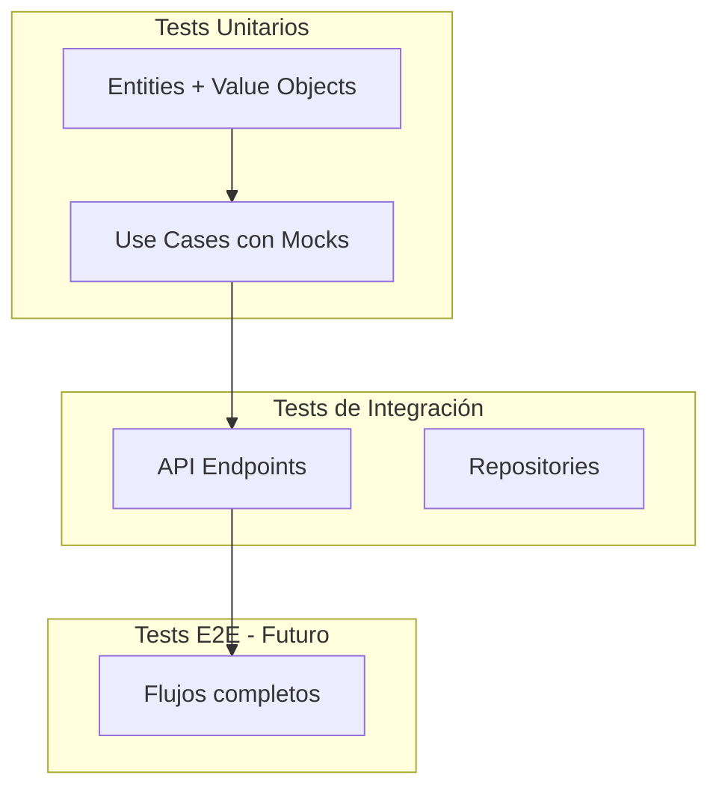

# Testing

Guía completa de testing para el proyecto.

## Visión General

El proyecto utiliza **Jest** como framework de testing con **mongodb-memory-server** para tests de integración, garantizando tests rápidos, aislados y sin dependencias externas.

## Estrategia de Testing



## Estructura de Tests

```
test/
├── unit/                              # Tests unitarios (✅ implementados)
│   └── controllers/
│       └── DriverController.test.ts   # Tests con mocks para casos de error
│
├── integration/                       # Tests de integración (✅ implementados)
│   └── api/
│       └── DriverController.test.ts   # 17 tests de endpoints
│
└── helpers/
    └── testDatabase.ts                # Helper para DB in-memory
```

### Convención de Nomenclatura

**Regla:** El nombre del archivo de test debe corresponder con la clase que está testeando.

- ✅ **Correcto:** `DriverController.test.ts` para testear `DriverController.ts`
- ❌ **Incorrecto:** `driver.test.ts` o `controller.test.ts`

**El tipo de test se indica por la ubicación:**
- `test/unit/` → Tests unitarios (con mocks)
- `test/integration/` → Tests de integración (con DB real in-memory)

**No usar sufijos redundantes:**
- ❌ `DriverController.unit.test.ts`
- ❌ `DriverController.integration.test.ts`
- ✅ `DriverController.test.ts` (la carpeta ya indica el tipo)

## Tests de Integración

### Setup de Base de Datos

[`test/helpers/testDatabase.ts`](../test/helpers/testDatabase.ts)

**Reglas para configurar la base de datos de tests:**

- Usar `mongodb-memory-server` para crear una instancia de MongoDB en memoria
- Implementar `setupTestDatabase()` para:
  - Crear el servidor MongoDB in-memory
  - Obtener la URI de conexión
  - Conectar la aplicación a la base de datos de test
- Implementar `teardownTestDatabase()` para:
  - Detener el servidor MongoDB in-memory
  - Liberar recursos después de todos los tests
- Implementar `clearDatabase()` para:
  - Limpiar todas las colecciones entre tests
  - Asegurar que cada test comience con estado limpio
  - Evitar dependencias entre tests

### Tests de API - DriverController

[`test/integration/api/DriverController.test.ts`](../test/integration/api/DriverController.test.ts)

**Cobertura actual: 17 tests**

#### Setup de Tests de Integración

**Reglas para el lifecycle de tests:**

- Usar `beforeAll()` para:
  - Inicializar la base de datos de test una sola vez
  - Crear la instancia de la aplicación Express
  - Configurar recursos compartidos entre tests
- Usar `afterAll()` para:
  - Cerrar la conexión a la base de datos
  - Detener el servidor MongoDB in-memory
  - Liberar recursos globales
- Usar `beforeEach()` para:
  - Limpiar la base de datos antes de cada test
  - Asegurar que cada test comience con estado consistente
  - Evitar efectos secundarios entre tests
- ❌ No usar `afterEach()` a menos que sea necesario limpiar recursos específicos del test

#### Tests Implementados

**POST /api/conductores** (4 tests)
- ✅ Crear conductor con datos válidos → 201
- ✅ Error con campos faltantes → 400
- ✅ Error con email inválido → 400
- ✅ Error con licencia duplicada → 400

**GET /api/conductores** (2 tests)
- ✅ Listar todos (vacío) → 200 + []
- ✅ Listar todos (con datos) → 200 + array

**GET /api/conductores/:id** (2 tests)
- ✅ Obtener por ID existente → 200
- ✅ Error con ID inexistente → 404

**PUT /api/conductores/:id** (5 tests)
- ✅ Actualizar conductor → 200
- ✅ Actualizar conductor con fechaNacimiento → 200
- ✅ Error con ID inexistente → 404
- ✅ Error con email inválido → 400
- ✅ Error con licencia duplicada → 400

**DELETE /api/conductores/:id** (2 tests)
- ✅ Eliminar conductor → 204
- ✅ Error con ID inexistente → 404

**Otros** (2 tests)
- ✅ Health check → 200
- ✅ Ruta no encontrada → 404

### Reglas para Tests de Integración

**Estructura de un test de integración:**

- Preparar datos de test realistas y completos
- Usar `supertest` con `request(app)` para hacer peticiones HTTP
- Encadenar `.expect(statusCode)` para verificar el código de respuesta
- Validar el cuerpo de la respuesta con:
  - `toMatchObject()` para verificar propiedades específicas
  - `toHaveProperty()` para verificar existencia de campos
  - Comparaciones exactas cuando sea necesario
- ✅ Verificar siempre el status code HTTP correcto
- ✅ Validar propiedades críticas del response body
- ✅ Verificar que se generan IDs y timestamps automáticos
- ❌ No asumir valores de campos generados automáticamente

## Tests Unitarios

### Tests de Controladores

[`test/unit/controllers/DriverController.test.ts`](../test/unit/controllers/DriverController.test.ts)

**Cobertura actual: 12 tests de manejo de errores**

Estos tests verifican todos los casos de error del controlador usando mocks:

**Tests para `create`:**
- ✅ Manejo de errores genéricos (Error)
- ✅ Manejo de excepciones no-Error (500)

**Tests para `getById`:**
- ✅ Manejo de errores genéricos (Error)
- ✅ Manejo de excepciones no-Error (500)

**Tests para `getAll`:**
- ✅ Manejo de errores genéricos (Error)
- ✅ Manejo de excepciones no-Error (500)

**Tests para `update`:**
- ✅ Manejo de DriverUpdateException
- ✅ Manejo de errores genéricos (Error)
- ✅ Manejo de excepciones no-Error (500)

**Tests para `delete`:**
- ✅ Manejo de DriverDeleteException
- ✅ Manejo de errores genéricos (Error)
- ✅ Manejo de excepciones no-Error (500)

### Reglas para Tests Unitarios con Mocks

**Configuración de mocks:**

- Declarar variables para el componente bajo test y sus dependencias
- Usar `jest.Mocked<Type>` para tipar mocks correctamente
- En `beforeEach()`:
  - Crear mocks frescos de todas las dependencias
  - Configurar comportamiento por defecto de los mocks
  - Instanciar el componente bajo test con los mocks

**Para controladores de Express:**

- Mockear Request con `Partial<Request>` incluyendo params, body, query
- Mockear Response con:
  - `status: jest.fn().mockReturnThis()` para permitir encadenamiento
  - `json: jest.fn()` para capturar respuestas JSON
  - `send: jest.fn()` para respuestas sin body

**Verificaciones en tests:**

- Usar `mockDependency.method.mockResolvedValue()` para simular respuestas asíncronas
- Usar `mockDependency.method.mockRejectedValue()` para simular errores
- Verificar llamadas con `expect(mock).toHaveBeenCalledWith(args)`
- Verificar que el mock fue llamado con `expect(mock).toHaveBeenCalled()`
- ✅ Testear tanto casos de éxito como de error
- ✅ Verificar que se manejan correctamente todas las excepciones

### Reglas para Tests de Entidades

**Tests de validación:**

- Testear cada validación de campo requerido
- Verificar que se lanza la excepción correcta (ej: `ValidationException`)
- Usar `expect(() => { ... }).toThrow(ExceptionType)`
- Incluir tests para:
  - Campos vacíos o undefined
  - Formatos inválidos (email, teléfono, etc.)
  - Valores fuera de rango
  - Reglas de negocio específicas

**Tests de métodos factory:**

- Testear el método `create()` con datos válidos
- Verificar que se asignan correctamente todos los campos
- Verificar que se generan automáticamente:
  - IDs únicos
  - Timestamps (fechaCreacion, fechaActualizacion)
  - Valores por defecto (ej: activo = true)

**Tests de métodos de actualización:**

- Verificar que solo se actualizan los campos especificados
- Confirmar que los campos no especificados mantienen su valor
- Verificar que el ID permanece inmutable
- Comprobar que se actualiza fechaActualizacion

**Organización:**

- Agrupar tests relacionados con `describe()`
- Un describe por método o funcionalidad
- Nombres descriptivos que expliquen qué se está testeando

### Reglas para Tests de Use Cases

**Setup de mocks del repositorio:**

- Crear mock completo del repositorio con todos sus métodos
- Cada método debe ser un `jest.fn()`
- Inicializar el use case con el repositorio mockeado
- Recrear mocks en `beforeEach()` para tests independientes

**Tests del caso de éxito:**

- Configurar mocks para simular el flujo exitoso
- Usar `mockResolvedValue()` para métodos asíncronos exitosos
- Ejecutar el use case con un DTO válido
- Verificar que se llamaron los métodos esperados del repositorio
- Verificar el orden correcto de las llamadas si es relevante
- Validar el resultado retornado

**Tests de casos de error:**

- Testear cada excepción de dominio que puede lanzar el use case
- Configurar mocks para simular condiciones de error
- Usar `expect(promise).rejects.toThrow(ExceptionType)`
- Verificar que NO se ejecutaron operaciones posteriores al error
- Usar `expect(mock).not.toHaveBeenCalled()` para verificar no ejecución

**Verificaciones importantes:**

- ✅ Verificar argumentos exactos con `toHaveBeenCalledWith()`
- ✅ Confirmar que se respetan las reglas de negocio
- ✅ Validar interacciones con el repositorio
- ❌ No testear implementación del repositorio (eso va en tests de integración)

## Comandos de Testing

### Ejecutar Todos los Tests
```bash
npm test
```

### Tests en Modo Watch
```bash
npm run test:watch
```

### Solo Tests de Integración
```bash
npm run test:integration
```

### Coverage Detallado
```bash
npm test -- --coverage --verbose
```

### Ejecutar Test Específico
```bash
npm test -- DriverController.test.ts
```

### Ejecutar Solo Tests Unitarios
```bash
npm test -- test/unit
```

### Ejecutar Solo Tests de Integración
```bash
npm test -- test/integration
```

### Ejecutar Tests con Patrón
```bash
npm test -- --testNamePattern="should create"
```

## Configuración de Jest

[`jest.config.js`](../jest.config.js)

**Configuraciones esenciales:**

- `preset: 'ts-jest'` - Habilita soporte para TypeScript
- `testEnvironment: 'node'` - Usa entorno Node.js (no DOM)
- `roots: ['<rootDir>/test']` - Define dónde buscar tests
- `testMatch: ['**/*.test.ts']` - Patrón para encontrar archivos de test

**Configuración de cobertura:**

- `collectCoverageFrom: ['src/**/*.ts']` - Incluye todo el código fuente
- Excluir archivos con `!` (ej: `!src/index.ts`, `!src/**/*.d.ts`)
- `coverageDirectory: 'coverage'` - Carpeta para reportes
- `coverageReporters: ['text', 'lcov', 'html']` - Formatos de reporte

**Reglas generales:**

- ✅ Excluir archivos de configuración del coverage
- ✅ Excluir archivos de tipos (.d.ts)
- ✅ Excluir el punto de entrada (index.ts) si solo hace setup
- ❌ No incluir carpeta test en collectCoverageFrom

## Mejores Prácticas

### Estructura de Tests

**Patrón AAA: Arrange, Act, Assert**

Organizar cada test en tres secciones claras:

**1. Arrange (Preparar):**
- Preparar datos de entrada
- Configurar mocks y sus comportamientos
- Establecer precondiciones
- Crear instancias necesarias

**2. Act (Actuar):**
- Ejecutar la función o método bajo test
- Realizar una sola acción principal
- Capturar el resultado o error

**3. Assert (Verificar):**
- Verificar el resultado esperado
- Comprobar efectos secundarios
- Validar interacciones con mocks
- Confirmar que se lanzaron excepciones esperadas

**Reglas:**
- ✅ Separar claramente las tres secciones (con comentarios o espacios)
- ✅ Una sola acción (Act) por test
- ✅ Múltiples assertions son válidas si verifican el mismo resultado
- ❌ No mezclar preparación con verificación

### Nombres Descriptivos

**Reglas para nombrar tests:**

- ✅ Usar formato: `should [acción] when [condición]`
- ✅ Describir el comportamiento esperado, no la implementación
- ✅ Ser específico sobre el caso de test
- ✅ Incluir el tipo de excepción o resultado esperado
- ❌ No usar nombres genéricos como "test1", "works", "it works"
- ❌ No usar nombres ambiguos que no describan el caso

**Ejemplos:**
- ✅ `should throw ValidationException when email is invalid`
- ✅ `should return 404 when driver does not exist`
- ✅ `should create driver with generated ID and timestamps`
- ❌ `test email`
- ❌ `validation test`
- ❌ `it works`

### Tests Independientes

**Reglas para mantener tests independientes:**

- ✅ Usar `beforeEach()` para limpiar estado antes de cada test
- ✅ Limpiar base de datos entre tests de integración
- ✅ Recrear mocks en cada test
- ✅ Cada test debe poder ejecutarse solo
- ✅ Cada test debe poder ejecutarse en cualquier orden
- ❌ No compartir variables mutables entre tests
- ❌ No depender de que otro test se ejecute primero
- ❌ No asumir orden de ejecución de tests
- ❌ No dejar datos residuales en la base de datos

**Consecuencias de tests dependientes:**
- Tests fallan cuando se ejecutan individualmente
- Tests fallan en orden aleatorio
- Difícil debuggear problemas
- Falsos positivos o negativos

### Mocks Específicos

**Reglas para crear mocks efectivos:**

- ✅ Mockear solo las dependencias externas necesarias
- ✅ Configurar solo los métodos que se van a usar en el test
- ✅ Usar `mockResolvedValue()` para simular promesas exitosas
- ✅ Usar `mockRejectedValue()` para simular errores
- ✅ Usar `mockReturnValue()` para métodos síncronos
- ✅ Definir comportamiento específico para cada test
- ❌ No mockear toda la interfaz si solo usas algunos métodos
- ❌ No usar el mismo mock para todos los tests sin resetear
- ❌ No mockear clases del dominio (testear el código real)
- ❌ No mockear funciones triviales (ej: getters simples)

**Cuándo mockear:**
- Dependencias de infraestructura (base de datos, APIs externas)
- Servicios con efectos secundarios
- Operaciones costosas o lentas
- Dependencias que no estás testeando en ese momento

**Cuándo NO mockear:**
- Lógica de dominio (entidades, value objects)
- Código bajo test
- Funciones puras simples

## Roadmap de Testing

### Fase 1: Tests Básicos (✅ Completado)
- ✅ Tests de integración de API (17 tests)
- ✅ Tests unitarios de DriverController (12 tests)
- ✅ Cobertura 100% de DriverController
- ✅ Setup de MongoDB in-memory

### Fase 2: Tests Unitarios de Dominio (Próximo)
- [ ] Tests de entidad `Driver`
- [ ] Tests de validadores (EmailValidator)
- [ ] Tests de excepciones
- [ ] Tests de `CreateDriverUseCase` con mocks
- [ ] Tests de `UpdateDriverUseCase` con mocks

### Fase 3: Más Tests de Integración
- [ ] Tests de `MongoDriverRepository` directamente
- [ ] Tests de middleware (cuando se implementen)
- [ ] Tests de manejo de errores globales

### Fase 4: Tests E2E (Futuro)
- [ ] Flujos completos de usuario
- [ ] Tests de performance
- [ ] Tests de carga

## Tips para Tests con Claude

### Reglas para solicitar tests a Claude

**Al crear tests nuevos:**
- Especificar qué componente testear (entidad, use case, controlador)
- Listar explícitamente qué casos cubrir
- Indicar si son tests unitarios o de integración
- Mencionar qué validaciones o métodos testear

**Al mejorar cobertura:**
- Pedir revisar cobertura actual del componente
- Solicitar tests para líneas no cubiertas
- Especificar nivel de cobertura deseado
- Indicar si hay casos edge específicos a cubrir

**Al implementar features nuevas:**
- Pedir tests junto con la implementación
- Especificar tipos de tests necesarios (unitarios + integración)
- Listar endpoints o métodos a testear
- Indicar casos de éxito y error a cubrir

**Ejemplos de prompts efectivos:**
- "Crea tests unitarios para Driver que cubran todas las validaciones"
- "Revisa cobertura de DriverController y crea tests para casos faltantes"
- "Al implementar Vehicle, incluye tests unitarios de entidad y use cases"
- "Crea tests de integración para endpoints CRUD de vehicles"

## Debugging de Tests

### Ver Logs Durante Tests
```bash
npm test -- --verbose
```

### Ejecutar un Solo Test

**Reglas para focalizar tests:**

- Usar `it.only()` para ejecutar un solo test
- Usar `describe.only()` para ejecutar un grupo de tests
- ✅ Útil para:
  - Debuggear un test específico que falla
  - Desarrollar un nuevo test sin ejecutar todos
  - Investigar un problema específico
- ⚠️ Recordar quitar `.only()` antes de hacer commit
- ❌ No dejar `.only()` en código que va a main/master
- ❌ No usar múltiples `.only()` sin intención

### Skip de Tests Temporalmente

**Reglas para saltar tests:**

- Usar `it.skip()` para saltar un test específico
- Usar `describe.skip()` para saltar un grupo de tests
- ✅ Usar cuando:
  - Test está temporalmente roto por cambios en progreso
  - Feature está deshabilitada temporalmente
  - Test necesita refactoring pero no quieres borrarlo
- ⚠️ Agregar comentario explicando por qué se saltó
- ⚠️ Crear ticket o TODO para arreglar el test
- ❌ No dejar tests con `.skip()` indefinidamente
- ❌ No usar como solución permanente
- ❌ No skipear tests que fallan para "pasar" CI

### Debugging con VSCode

**Configuración para debuggear tests:**

Agregar a `.vscode/launch.json` una configuración con:

- `type: "node"` - Tipo de debugger
- `request: "launch"` - Iniciar nueva instancia
- `program: "${workspaceFolder}/node_modules/.bin/jest"` - Ejecutable de Jest
- `args: ["--runInBand"]` - Ejecutar tests secuencialmente
- `console: "integratedTerminal"` - Usar terminal integrada
- `internalConsoleOptions: "neverOpen"` - No abrir consola de debug

**Opciones útiles en args:**
- `--runInBand` - Ejecutar tests en serie (necesario para debugging)
- `--no-cache` - Ignorar cache de Jest
- `--testPathPattern=nombre` - Solo tests que coincidan con el patrón
- `--verbose` - Más información de salida

**Uso:**
- Establecer breakpoints en el código
- Seleccionar la configuración "Jest Debug" en VSCode
- Presionar F5 o Run > Start Debugging
- Tests se pausarán en los breakpoints

## Referencias

- [Jest Documentation](https://jestjs.io/)
- [SuperTest Documentation](https://github.com/visionmedia/supertest)
- [mongodb-memory-server](https://github.com/nodkz/mongodb-memory-server)
- [Testing Best Practices](https://testingjavascript.com/)

---

**Siguiente**: Implementar tests unitarios siguiendo los ejemplos de esta guía.
